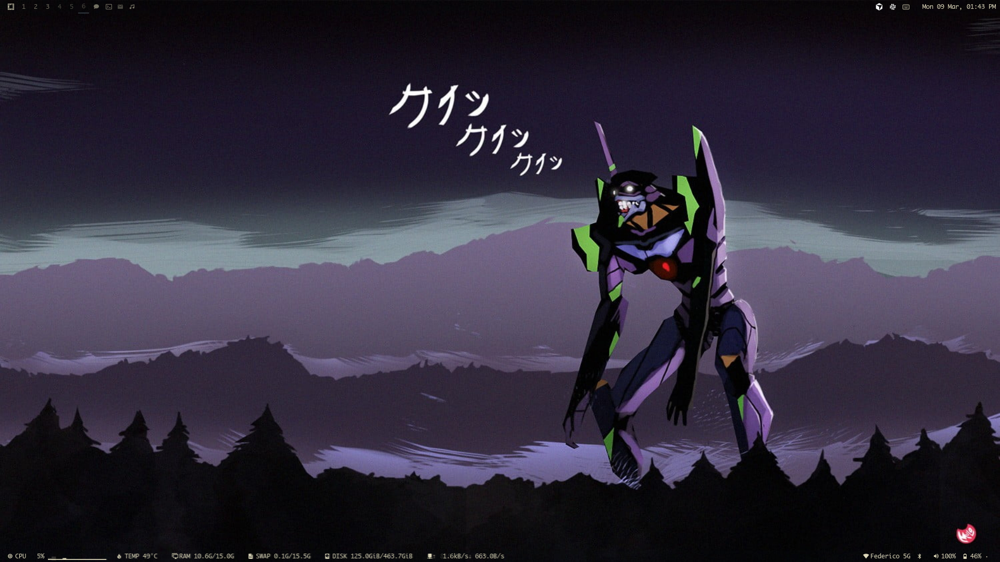
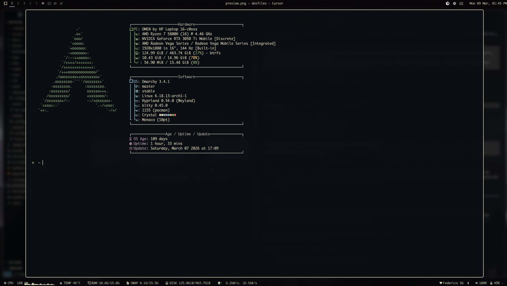
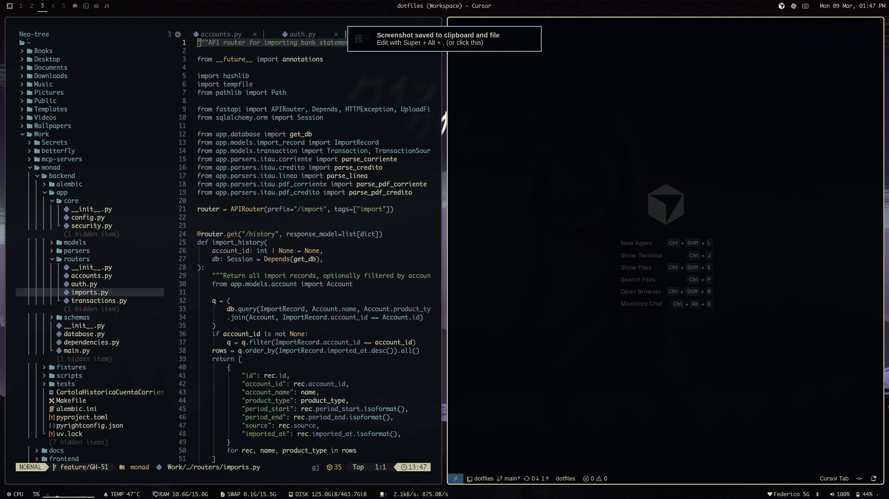

# omarchy-theme-crystal

A dark theme for [Omarchy](https://omarchy.com) built on [Kanso Zen](https://github.com/webhooked/kanso-vscode) backgrounds with Kanagawa-warm foreground for readability.





## Install

```bash
omarchy-theme-install https://github.com/aldochaconc/omarchy-theme-crystal
```

## Color Architecture

`colors.toml` is the **single source of truth** for all colors across the entire ecosystem:

```
colors.toml
    ├─→ kitty, alacritty, ghostty    (auto-generated via Omarchy .tpl templates)
    ├─→ mako, walker, hyprland,
    │   hyprlock, chromium            (auto-generated via Omarchy .tpl templates)
    ├─→ waybar.css                    (custom override with extra CSS vars)
    ├─→ swayosd.css                   (custom override with styling rules)
    ├─→ btop.theme                    (custom gradient assignments)
    ├─→ rofi.rasi                     (custom color palette, no template exists)
    └─→ neovim.lua                    (reads colors.toml at startup, maps to Kanso palette)
```

Files not present in this repo are auto-generated by Omarchy's template engine (`omarchy-theme-set`)
from `.tpl` templates + `colors.toml`. Custom overrides are only provided where the template
output is insufficient.

## Ecosystem

| App | Theme source | Config |
|-----|-------------|--------|
| Kitty | `colors.toml` via template | (auto-generated) |
| Alacritty | `colors.toml` via template | (auto-generated) |
| Ghostty | `colors.toml` via template | (auto-generated) |
| Mako | `colors.toml` via template | (auto-generated) |
| Walker | `colors.toml` via template | (auto-generated) |
| Hyprland | `colors.toml` via template | (auto-generated) |
| Hyprlock | `colors.toml` via template | (auto-generated) |
| Chromium | `colors.toml` via template | (auto-generated) |
| Neovim | `colors.toml` → Kanso Zen palette | `neovim.lua` |
| VS Code | Kanso Zen extension | `vscode.json` |
| Waybar | Custom CSS vars | `waybar.css` |
| SwayOSD | Custom styling | `swayosd.css` |
| Btop | Custom gradients | `btop.theme` |
| Rofi | Custom palette | `rofi.rasi` |

## Colors

Based on [Kanso Zen](https://github.com/webhooked/kanso.nvim) backgrounds with [Kanagawa](https://github.com/rebelot/kanagawa.nvim) foreground warmth.

| Role | Hex | Note |
|------|-----|------|
| Background | `#090E13` | Kanso Zen (zenBg0) |
| Foreground | `#dcd7ba` | Kanagawa warm — better readability |
| Accent | `#8BA4B0` | Kanso blue3 |
| Cursor | `#c8c093` | Kanagawa warm |
| Selection BG | `#24262D` | Kanso zenBg2 |

## Design Decisions

- **Kanso Zen backgrounds** — deep, rich darks (`#090E13`, `#1C1E25`, `#22262D`)
- **Kanagawa foreground** — warm golden `#dcd7ba` instead of Kanso's cooler `#C5C9C7`, chosen for readability
- **Unified via colors.toml** — Neovim reads the same file as terminal templates, eliminating color drift
- **Minimal overrides** — only ship files where templates are insufficient; let Omarchy generate the rest
